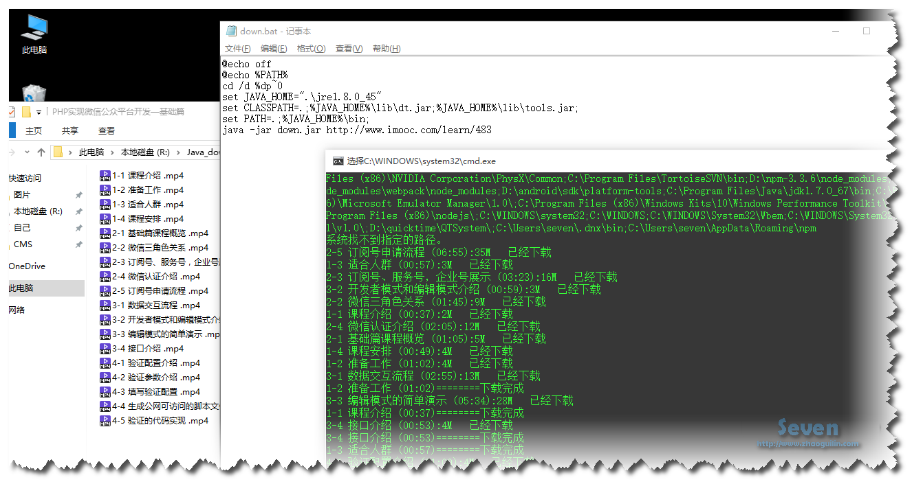

# imooc
##imooc 视频小爬虫
 * 简单爬取imooc (http://www.imooc.com) 视频教程
 * 依赖gson-2.2.4 jsoup-1.8.3 JRE/JDK1.8
 * ps:启动脚本
 * 仅此，分享给大家，正在学爪哇的大家
 * QQ群 [吾爱Java: 170936712](http://jq.qq.com/?_wv=1027&k=28XUDSI)
 * 个人博客[http://www.zhaoguilin.com](http://www.zhaoguilin.com)  
'''JavaScript
@echo off
@echo %PATH%
cd /d %dp~0
set JAVA_HOME=".\jre1.8.0_45"
set CLASSPATH=.;%JAVA_HOME%\lib\dt.jar;%JAVA_HOME%\lib\tools.jar;
set PATH=.;%JAVA_HOME%\bin;
java -jar down.jar http://www.imooc.com/learn/483
::down.jar为编译后的jar文件，后面第一个参数表明视频地址，第二个参数表明下载路径
::默认R:\\Java_download下。  win下批处理
'''

